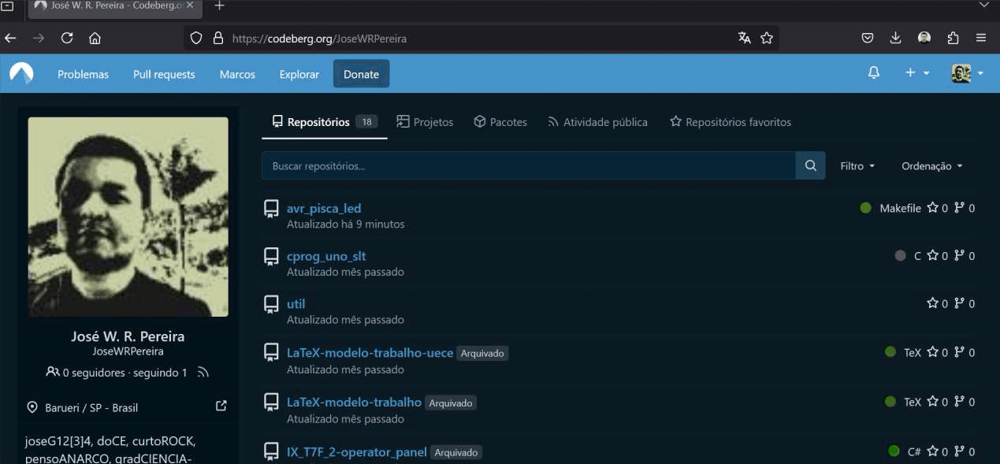
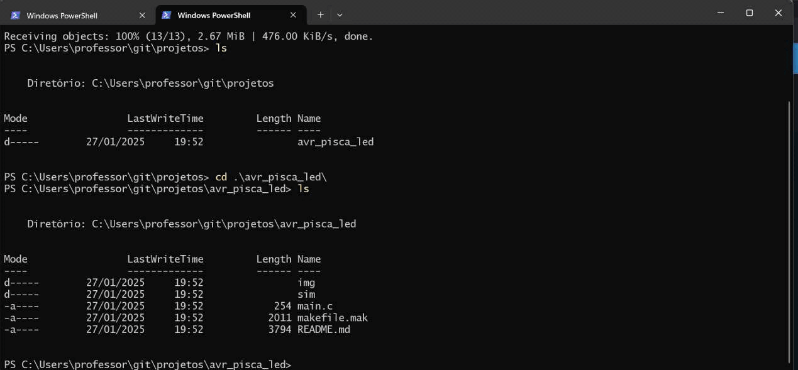
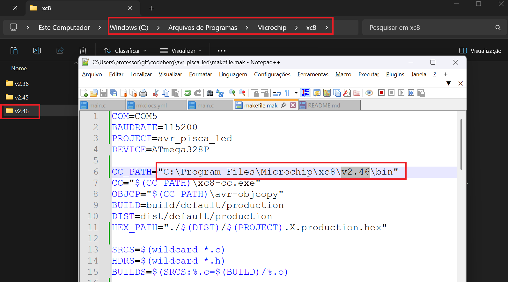

# AVR Pisca LED

O primeiro programa para dispositivos embarcados, costuma ser um programa para piscar um LED, que server para testar as ferramentas de compilação e gravação, verificando sua integridade e capacidade de execução.

Este projeto contém um programa mínimo para piscar um LED na plataforma Arduino Uno, porém o seu desenvolvimento se dá com a utilização e programação do microcontrolador de forma direta, sem a utilização do que chamamos *framework* Arduino.

|      Componente       |                                                                Modelo                                                                |                                                                   Descrição                                                                   |
| :-------------------: | :----------------------------------------------------------------------------------------------------------------------------------: | :-------------------------------------------------------------------------------------------------------------------------------------------: |
|   Microcontrolador    | [AVR - ATMega328P](https://ww1.microchip.com/downloads/en/DeviceDoc/Atmel-7810-Automotive-Microcontrollers-ATmega328P_Datasheet.pdf) |                                                     Plataforma Arduino Uno como interface                                                     |
|      Compilador       |                        [XC8](https://www.microchip.com/en-us/tools-resources/develop/mplab-xc-compilers/xc8)                         |                         [Instalação](https://developerhelp.microchip.com/xwiki/bin/view/software-tools/xc8/install/)                          |
|   Editor de código    |                                        [Notepad++](https://notepad-plus-plus.org/downloads/)                                         |                                                                                                                                               |
| Construtor de projeto |                   [Makefile](https://stackoverflow.com/questions/32127524/how-to-install-and-use-make-in-windows)                    |                                                                                                                                               |
|    Gravador do AVR    |                                         [AVRDudess](https://github.com/ZakKemble/AVRDUDESS)                                          |                                                                                                                                               |
| Simulador eletrônico  |                                            [SimulIDE](https://simulide.com/p/downloads/)                                             |                                                                                                                                               |
|     Versionamento     |                                                 [git](https://git-scm.com/downloads)                                                 |                                                                                                                                               |

Para testar a integridade das ferramentas de desenvolvimento aqui utilizadas, no seu computador, siga os passos: 

| Figura 1: Baixar o projeto do servidor git (Codeberg ou Github); |
|:----------------------------------------------------------------:|
|                                    |
| Fonte: Autor  										           |

| Figura 2: Verificar o local de instalação e a versão do compilador (XC8); |
|:-------------------------------------------------------------------------:|
|                                               |
|                                                                           |
|                                               |
| Fonte: Autor  		        								            |

| 3. Conectar e verificar a porta de comunicação com o Arduino Uno (Com5 no meu caso de exemplo); |
|:-------------------------------------------------------------------------:|
|                                                      |
| Fonte: Autor  		        								            |

| 4. Testar a compilação e a gravação do projeto;                           |
|:-------------------------------------------------------------------------:|
|  |
| Fonte: Autor  		        								            |

| 5. Testar a simulação utilizando o software SimulIDE; |
|:-----------------------------------------------------:|
|              |
| Fonte: Autor  		        						|

| 6. Simulação de Pisca LED                             |
|:-----------------------------------------------------:|
|                         |
| Fonte: Autor  		        						|

